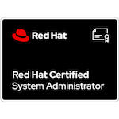

<!--
**abdelhousni/abdelhousni** is a ✨ _special_ ✨ repository because its `README.md` (this file) appears on your GitHub profile.

Here are some ideas to get you started:

- 🔭 I’m currently working on ...
- 🌱 I’m currently learning ...
- 👯 I’m looking to collaborate on ...
- 🤔 I’m looking for help with ...
- 💬 Ask me about ...
- 📫 How to reach me: ...
- 😄 Pronouns: ...
- ⚡ Fun fact: ...
-->

🔭 I’m currently working for [@Etnic](https://etnic.be) as Linux System Administrator.

I'm also certified in : 
[Red Hat Certified System Administrator (RHCSA) ](https://www.credly.com/badges/28c12d0e-318a-4cef-a5d6-ed144a377393/public_url)

To reach me : 
<!---->
 

  

